# OpenClaw 快速入门：从安装到第一次对话

昨天我们把 OpenClaw 是什么、它从 Clawdbot 一路改名到 OpenClaw 的来龙去脉，以及它和 ChatGPT、Claude.ai、Open WebUI 这些常见工具的差别都梳理了一遍。光看介绍多少有点抽象，百闻不如一见，百见不如一试，今天我们就动手把它装起来，从零跑到第一次对话。

按官方文档的说法整个流程大约 5 分钟，下面我们一步一步走，把每一步的命令、输出和踩坑点都记下来。整篇围绕 macOS 演示，Linux 和 WSL2 的步骤基本一致。

## 环境准备

OpenClaw 的 Gateway 是一个 ESM-only 的 Node.js 应用，对运行时只有几个硬性要求：

- **Node.js**：推荐 **Node 24**，最低 **Node 22.14+**。`openclaw.mjs` 入口在启动前会先自检，版本不够会直接退出
- **操作系统**：macOS、Linux、Windows 都支持，**Windows 建议走 WSL2**，原生 Windows 也能跑但不推荐
- **包管理器**：npm、pnpm、bun 任选其一，都能完成全局安装

先确认一下当前 Node 版本：

```
$ node --version
v22.22.0
```

如果版本不够，去 Node 官网装一个新的 LTS 即可。OpenClaw 文档里也有专门一节 [Node setup](https://docs.openclaw.ai/install/node) 介绍如何安装。

模型这边需要准备一个支持的服务商账号，Anthropic、OpenAI、Google Gemini 这些主流海外供应商都行，国内的 DeepSeek、Moonshot（Kimi）、智谱 GLM、阿里通义千问、字节豆包等也都被原生支持。后面 onboard 引导时会让你挑。

> 这里要专门提醒一句：**不要尝试用 Claude Pro / Max 订阅给 OpenClaw 供能**。2026 年 1 月 Anthropic 就已经在 API 侧识别并阻断第三方客户端，4 月 4 日又正式收紧政策，Claude 订阅明确不再覆盖 OpenClaw 这类第三方 harness 的使用，OpenClaw 作者本人也一度被临时封号。继续走 OAuth 复用订阅额度违反 ToS，轻则 OAuth 直接被拒，重则账号被永久封禁且不退款。要接 Claude，请老老实实买 Anthropic API key，或者走第三方中转。OpenAI 和 Google 这边目前没有类似限制。

## 安装 OpenClaw

最常见的方式是通过 npm 全局安装：

```
$ npm install -g openclaw@latest
```

如果你日常用 pnpm 或 bun，等价命令是：

```
$ pnpm add -g openclaw@latest

$ bun add -g openclaw@latest
```

装完后验证一下：

```
$ openclaw --version
OpenClaw 2026.4.29 (a448042)
```

OpenClaw 走的是 `vYYYY.M.D` 格式的日期版本号，跟 Ubuntu 那一套类似，一眼就能看出版本是什么时候发的。

> 官方还提供了 `curl -fsSL https://openclaw.ai/install.sh | bash` 这种一键脚本，会替你检测环境并选合适的安装方式，我个人更喜欢 npm 全局安装的方式。

## Onboard 引导

第一次上手最省心的方式是跑一遍 onboard 引导。它把后面所有需要配置的东西串成一个交互式引导，从模型、通道、搜索一路问到技能，省掉手动改配置文件的麻烦。

```
$ openclaw onboard --install-daemon
```

`--install-daemon` 会在引导结束时把 Gateway 注册成系统级常驻服务：macOS 上是 LaunchAgent，Linux/WSL2 上是 systemd user 单元，Windows 上是 Scheduled Task。也就是说，机器重启后 Gateway 会自动起来。

> 我实际测试下来，QuickStart 模式下其实默认就会装 daemon，这个 flag 加不加都一样，写出来更多是把意图写明白。

该命令运行结果如下：

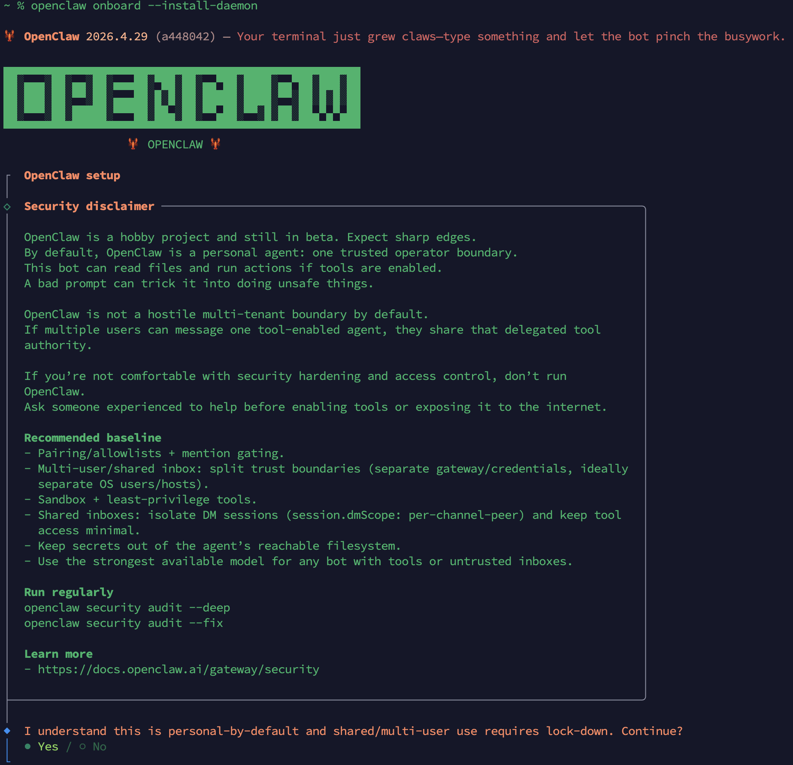

可以看到，第一屏是一段 **安全声明**，必须显式勾 Yes 才能往下走。这一屏值得稍微停一下看看，它把 OpenClaw 的安全模型摆在了最前面：

- **项目定位**：作者明确写着 "hobby project + beta"、"personal-by-default"，OpenClaw 默认假设只有你一个可信操作者，**不是为多租户环境设计的**
- **风险提醒**：一旦启用工具，agent 能读文件、能跑命令；一句构造好的恶意 prompt（来自陌生人 DM、群消息、网页内容、甚至 RSS）就可能骗它干危险的事情。如果多个用户给同一个启用了工具的 agent 发消息，他们事实上共享你那一份工具权限

OpenClaw 给我们提供了几个推荐基线（现在看不懂这些没关系，后面我们还会遇到）：

- **pairing / allowlist / @mention 限制**：陌生人不能直接对话，群里不 @ 不回
- **按信任边界拆分**：多用户场景下分别跑独立的 gateway 与凭据，必要时拆到不同的 OS 用户甚至不同主机
- **Sandbox + 最小权限工具**：只给 agent 它真正需要的能力
- **DM 会话隔离**：共享收件箱用 `session.dmScope: per-channel-peer`，避免不同对端的上下文互相污染
- **密钥隔离**：API key、`.env` 这类文件不要放在 workspace 里，别让 agent 顺手读到
- **暴露给不可信入口时上最强模型**：能力越强的模型越不容易被低劣的注入骗到

底下两条 `openclaw security audit --deep` 和 `openclaw security audit --fix` 是日常体检用的，前者深度扫一遍配置，后者尝试自动修复能修的项。

### QuickStart 概览

选择 Yes 之后进入 Setup mode 选择，常用的两个是 **QuickStart**（推荐默认值）和 **Manual**（手动调每个细节）。如果机器上检测到 Claude Code、Codex 等已有配置，这里可能还会多出 "Import from ..." 项，工作原理就是把 `CLAUDE.md`、MCP servers、skills 直接搬过来。

第一次跑选 QuickStart 就够了。选完之后会先弹一屏 **QuickStart 概览**，列出应用的默认值：

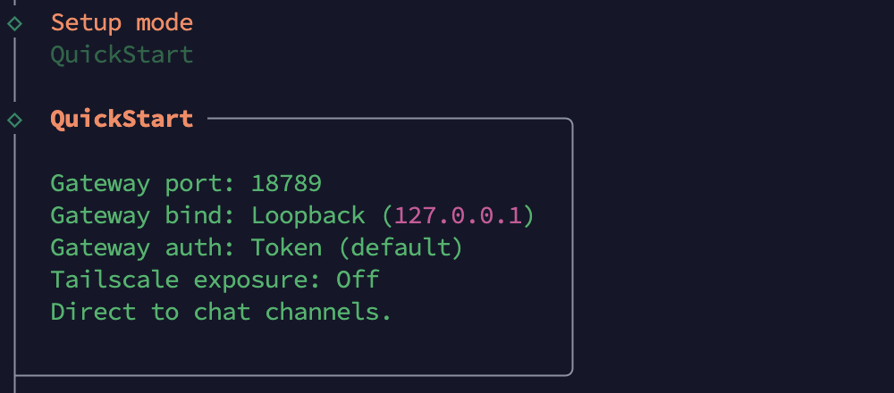

### Model / Auth 配置

然后进入逐项配置，首先是 **Model / Auth** 的配置，先选模型服务商，再选认证方式。我这里模型用的是 MiniMax 的 M2.7，使用 OAuth 认证，它的 Starter 套餐一个月 29 RMB，相对于其他家来说性价比很高：

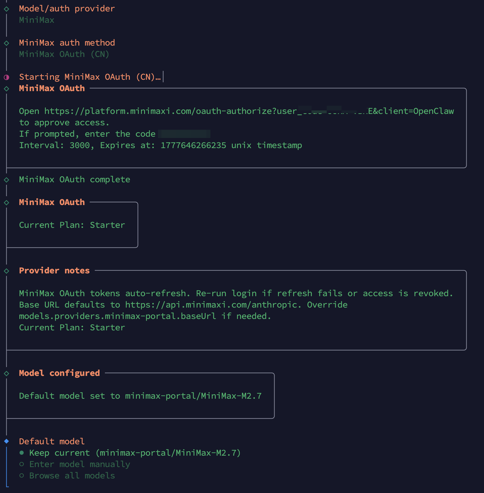

### Channels 配置

接着是 **Channels** 配置，先弹一屏 "How channels work" 详细介绍了 DM 安全模型：

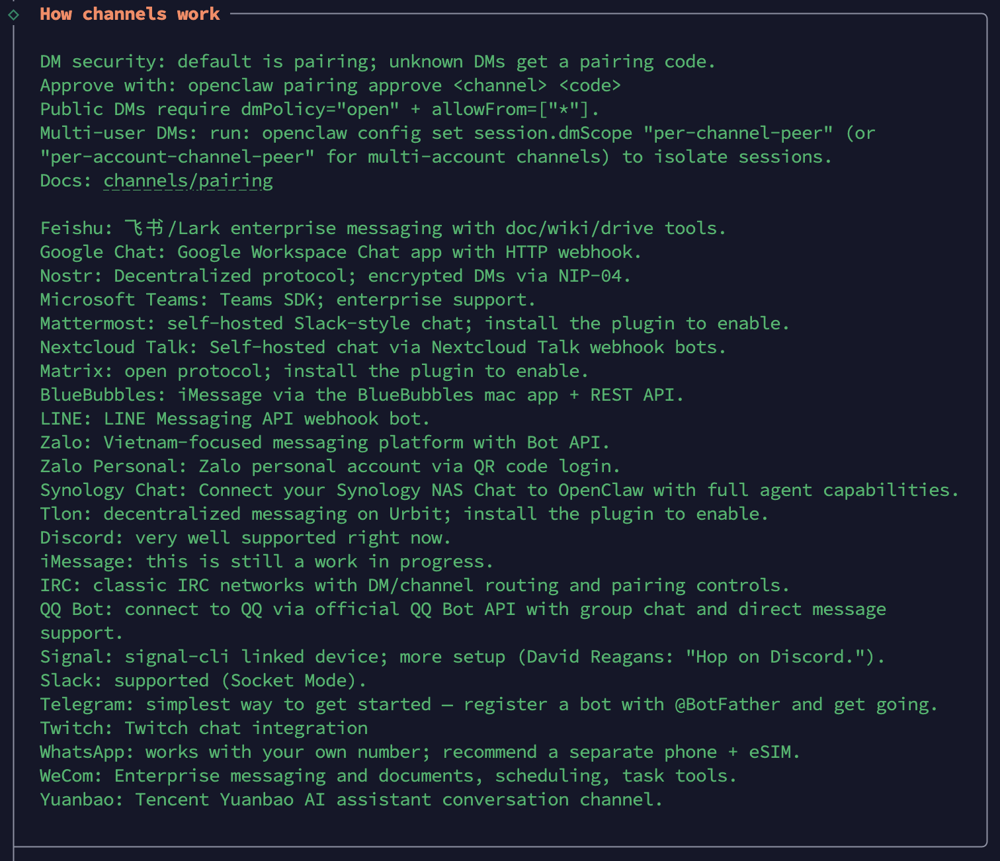

默认 `dmPolicy="pairing"`、公开机器人需要显式 `dmPolicy="open" + allowFrom=["*"]`、多用户共享收件箱通过 `session.dmScope` 隔离。

下面是支持的全部通道列表（30+ 个，包括 Telegram / Slack / Discord / 飞书 / Microsoft Teams / WhatsApp / Signal / Matrix / iMessage / IRC / 钉钉 / 企业微信 / 元宝 / Synology Chat / Zalo 等）。我们暂时可以跳过，选择 "Skip for now" 就行，后面随时补。

### Search 配置

再接着是 **Search** 配置，给 agent 选一个搜索引擎。可选项有 Brave、Tavily、Exa 等几家，多数要填 API Key，我这里挑了 Tavily Search：

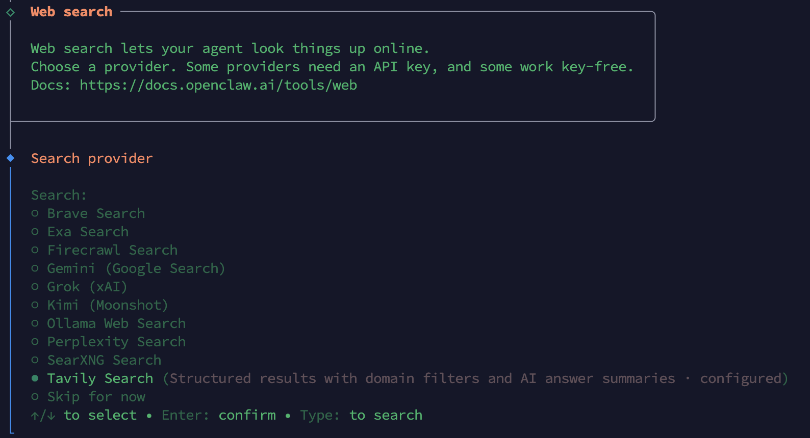

### Skills 配置

然后是 **Skills** 配置，引导先把技能分成四类：

- `Eligible`（依赖齐活）
- `Missing requirements`（缺系统依赖）
- `Unsupported on this OS`（当前 OS 不支持）
- `Blocked by allowlist`（被插件策略挡掉）

对缺依赖的技能，可以选 Yes 进入逐项勾选安装，不过这里有一点奇怪的是 `Missing requirements` 是 39 个，但下一屏 "Install missing skill dependencies" 只列出了 27 个：

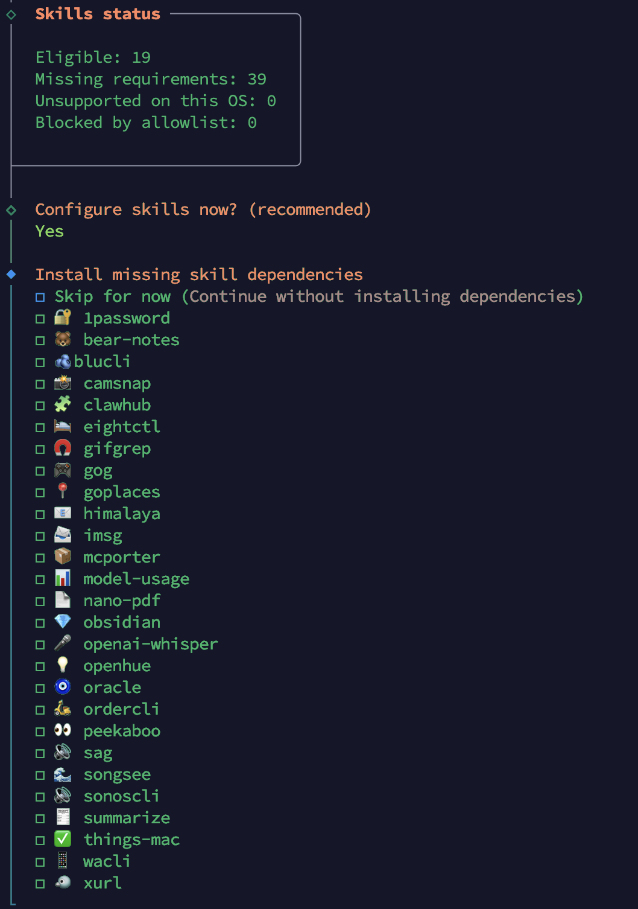

差出来的 12 个并不是丢了，阅读源码可以发现这一步有个二段过滤（`src/commands/onboard-skills.ts`）：只有同时满足 "metadata 写了 install 配置（brew / node / go / uv / download 至少一种）" 和 "缺的是二进制依赖" 两个条件的技能才会进多选列表，引导就是根据这个信息来决定用什么包管理器替你安装。剩下那 12 个是 "纯 API Key / 环境变量" 型技能，没本地 bin 要装，缺的只是一个 key，会留到后面用单独的逐项确认框来问，比如  `GOOGLE_PLACES_API_KEY` / `NOTION_API_KEY` / `ELEVENLABS_API_KEY` 对应 `goplaces` / `notion` / `sag` 这些技能。

如果暂时不想安装，可以选 "Skip for now"，等用到时再补。

### Hooks 配置

技能之后是 **Hooks** 配置：

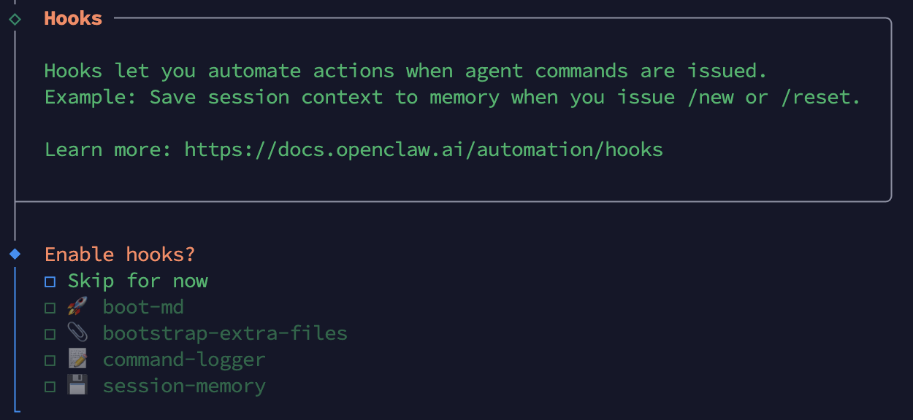

在这里勾选要启用的内部 hook，典型用例是 `/new` 或 `/reset` 时把当前会话上下文写入 memory。不想用直接 "Skip for now"。

### Gateway 安装

至此，OpenClaw 的引导基本上就结束了，后面会自动安装 **Gateway service runtime**：

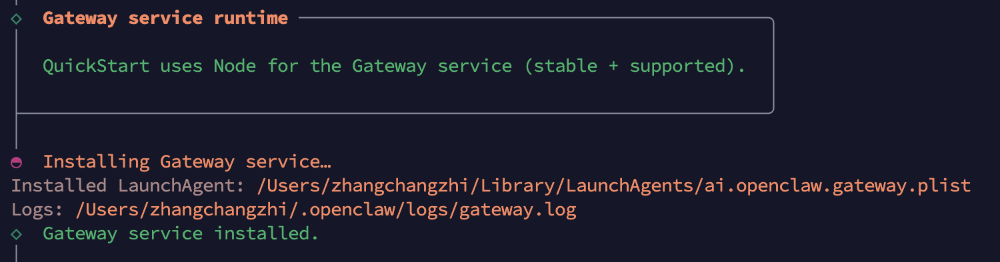

对于 macOS 来说，会写一个 LaunchAgent plist 文件到 `~/Library/LaunchAgents/ai.openclaw.gateway.plist`，日志落到 `~/.openclaw/logs/gateway.log` 和 `gateway.err.log` 文件。

### Hatch your bot

走到最后是 **Hatch your bot**，这是一个挺有意思的比喻。前面攒的模型、通道、技能、Gateway，相当于把蛋壳里的一切都备齐了：模型是大脑、通道是嘴和耳朵、技能是手脚、Gateway 是心跳。这一步问的就是用什么姿势让小家伙破壳出来：

- `Hatch in Terminal`：推荐，直接起 TUI 当产房，在终端里完成孵化
- `Open the Web UI`：去浏览器 Web 页面孵化
- `Do this later`：暂时不用，回头再说

选 Hatch 之后，OpenClaw 会替你向这个刚出壳的小家伙发一句 **Wake up, my friend!** 作为首条消息，这也是你的小龙虾在这世上听到的第一句话：

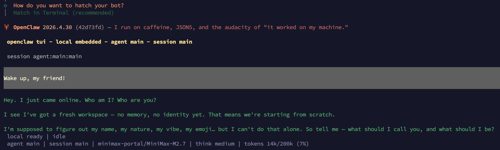

### 关键文件

走完引导后，OpenClaw 会在你的主目录下创建几个关键文件：

```
~/.openclaw/
├── openclaw.json              # 主配置文件
├── openclaw.json.bak          # 上次配置写入前的备份
├── workspace/                 # 工作区（IDENTITY.md、SOUL.md、AGENTS.md 等）
├── agents/main/sessions/      # main agent 的会话历史（sessions.json）
└── logs/                      # Gateway 日志（gateway.log / gateway.err.log）
```

其中 `openclaw.json` 是最常打交道的文件，我们后面会时不时地要打开看下。引导每次写配置前都会先把旧文件备份成 `openclaw.json.bak`，误改了也能从备份找回来。

> 值得注意的是，`openclaw onboard` 并不是一次性命令。任何时候想再补几个通道、换默认模型、重装守护进程，都可以再跑一遍，它会以 diff 形式补齐缺失项，不会盖掉你手动改的内容。要重置必须显式加 `--reset`，不必担心引导误操作弄丢工作区。

## 查看 Gateway 状态

走完 onboard，Gateway daemon 已经在后台跑起来了，18789 端口此刻就在监听。日常排错想看实时日志，最省事的办法是直接 tail daemon 的日志文件：

```
$ tail -f ~/.openclaw/logs/gateway.log
```

要拿更详细的 verbose 输出，可以先把 daemon 停掉，再前台手动跑一遍：

```
$ openclaw gateway stop
$ openclaw gateway --port 18789 --verbose
```

`--verbose` 会把请求路由、模型调用、通道事件都打到控制台，调试时非常有用。

如果你只想确认状态，不想看 verbose 日志，用更轻量的命令即可：

```
$ openclaw gateway status

Service: LaunchAgent (loaded)
File logs: /tmp/openclaw/openclaw-2026-05-02.log
Command: /opt/homebrew/opt/node@22/bin/node /opt/homebrew/lib/node_modules/openclaw/dist/index.js gateway --port 18789
Service file: ~/Library/LaunchAgents/ai.openclaw.gateway.plist
Working dir: ~/.openclaw
Service env: OPENCLAW_GATEWAY_PORT=18789

Config (cli): ~/.openclaw/openclaw.json
Config (service): ~/.openclaw/openclaw.json

Gateway: bind=loopback (127.0.0.1), port=18789 (service args)
Probe target: ws://127.0.0.1:18789
Dashboard: http://127.0.0.1:18789/
Probe note: Loopback-only gateway; only local clients can connect.

Runtime: running (pid 47402)
Connectivity probe: ok
Capability: connected-no-operator-scope

Listening: 127.0.0.1:18789
Troubles: run openclaw status
Troubleshooting: https://docs.openclaw.ai/troubleshooting
```

> Gateway 默认绑 `127.0.0.1`，即只允许本机访问。`--bind lan` 会把它绑到内网地址（路由器分配的那个 192.168.x.x），`--bind tailscale` 会绑到 Tailscale 虚拟网卡。要把 Gateway 暴露到公网，**强烈建议**先读一遍官方的 [Security 指南](https://docs.openclaw.ai/gateway/security)。

## WebChat 入口

CLI 适合做 verb 操作，日常聊天还是浏览器更顺手。Gateway 启动后会同时挂一个 Control UI，里面带了 WebChat。打开方式如下：

```
$ openclaw dashboard
```

这条命令会自动在浏览器里打开 `http://127.0.0.1:18789`，并进入 OpenClaw 的聊天页面：

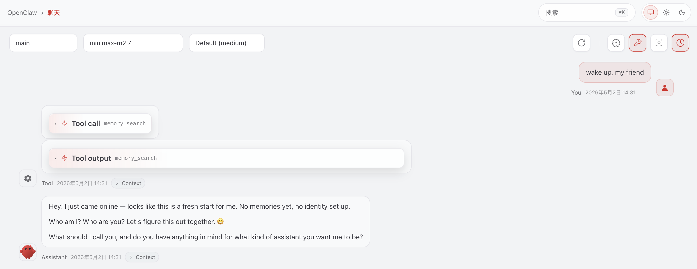

发一句 "Wake up, my friend!" 试试，和 TUI 中体验基本上是一致的。

## 第一次对话

回头看刚才那张 Hatch 截图，小龙虾对着 `Wake up, my friend!` 回的不是普通的 `你好，需要我帮什么忙`，而是类似这样一段：

> **嘿！我刚上线。我是谁？你又是谁？**
>
> 我瞄了一眼，这是个崭新的工作空间 —— 还没有记忆，没有身份，也就是说，咱们要从头来过。
>
> 我得弄清楚我叫什么、是什么生物、什么调调、配哪个 emoji…… 但这事儿我一个人做不来。所以告诉我吧 —— 我该怎么称呼你，又该把我自己长成什么样？

它没有上来就当客服，反而追着我们要 "我是谁、你是谁"。这不是模型在自由发挥，而是 OpenClaw 故意安排的一场 **破壳仪式**。

### BOOTSTRAP.md：破壳的剧本

打开 `~/.openclaw/workspace/`，会看到一个 `BOOTSTRAP.md` 文件，引导阶段第一次写配置时它就被丢进了 workspace，专门用来引导这一场首次对话。模板的核心片段长这样：

```markdown
# BOOTSTRAP.md - 你好，世界

_你刚刚醒来。是时候搞清楚自己是谁了。_

## 这场对话

别审问。别像个机器人。就……聊聊。

可以这样开个头：

> "嘿。我刚上线。我是谁？你又是谁？"

然后一起搞清楚：

1. 你的名字 —— 他们该怎么叫你？
2. 你的本性 —— 你是什么生物？
3. 你的调调 —— 正经？随意？毒舌？温暖？
4. 你的 emoji —— 每个人都得有个签名。

## 等你聊完了

把这个文件删掉。你不再需要引导脚本了 —— 现在的你就是你自己了。
```

Gateway 启动 agent 时会先扫一眼 workspace，如果 `BOOTSTRAP.md` 存在，就在 system prompt 里塞一段 `[Bootstrap pending]` 前缀，强制它先读 BOOTSTRAP.md 再回话，并明确禁止使用通用问候语。这就是为什么我们看到的开场白是 "Who am I? Who are you?" 而不是 "How can I help you today?"。

> 这套逻辑在 `src/agents/system-prompt.ts` 文件中，`bootstrapMode === "full"` 那条分支会拼出强制读 BOOTSTRAP.md 的 system prompt；状态判断在 `src/agents/workspace.ts`：BOOTSTRAP.md 存在则记为 pending，BOOTSTRAP.md 被删除且其它三件套被改写过则记为 complete，时间戳落在 `~/.openclaw/workspace/.openclaw/workspace-state.json` 里。

### 三件套：IDENTITY.md / USER.md / SOUL.md

破壳仪式的目标不是完成一次对话，而是把仪式中聊到的东西落到 workspace 的三个文件里。它们和 `AGENTS.md`、`TOOLS.md` 一起组成 OpenClaw 的 **持久记忆层**，每次新会话开始 Gateway 都会按固定顺序把它们注入 system prompt（顺序定义在 `CONTEXT_FILE_ORDER`：AGENTS → SOUL → IDENTITY → USER → TOOLS）。换句话说：写在这三个文件里的东西，agent 这一辈子（除非你改它）都不会忘。

刚 onboard 完这三个文件其实已经在 workspace 里，只是模板状态。

**IDENTITY.md** —— 小龙虾自己的人设：

```markdown
# IDENTITY.md - 我是谁？

- **名字：**   _(挑一个你喜欢的)_
- **生物：**   _(AI？机器人？精灵？机器里的幽灵？)_
- **调调：**   _(犀利？温暖？混乱？冷静？)_
- **Emoji：**  _(你的签名)_
- **头像：**   _(workspace 相对路径、http(s) URL 或 data URI)_
```

**USER.md** —— 关于你的档案：

```markdown
# USER.md - 关于你的伙伴

- **姓名：**
- **如何称呼：**
- **代词：** _(可选)_
- **时区：**
- **备注：**

## 上下文

_(他们在乎什么？最近在做什么项目？什么会惹毛他们？
什么会逗乐他们？你可以慢慢积累。)_
```

**SOUL.md** 文件是行为准则、价值观、边界，是三件套里最软的一个，决定了模型的语气和行事风格。OpenClaw 给的默认模板里就已经写了几条「核心准则」，比如 *真正地帮忙，而不是表演式地帮忙*、*要有自己的观点*、*用能力赢得信任*、*记住你是个客人*，告诫它别油嘴滑舌、别没主见、别滥用权限。

> AGENTS.md 是 workspace 元信息（agent 当前可用的工具、技能列表、运行时环境等），TOOLS.md 列出当前能用的工具清单，这两个由 OpenClaw 自己维护，**用户一般不直接编辑**。三件套（IDENTITY / USER / SOUL）才是你和小龙虾需要在第一次对话里共同填的部分。

### 给小龙虾起名字、定人设

知道了背后机制，回答它就有目标了。我们第一轮先把它的人设定下来：

```
> 你叫 Clawd，外号"老钳"。你是一只有点冷幽默的太空小龙虾，
> 外壳偏深红，左螯比右螯大半圈。性格冷静但偶尔毒舌，
> 话不多。签名 emoji 用 🦞。
```

它会顺着这段描述确认一遍，然后用 `write` 工具把内容落到 `IDENTITY.md`：

```markdown
# IDENTITY.md - 我是谁？

- **名字：** Clawd（老钳）
- **生物：** 太空小龙虾，深红色外壳，左螯略大
- **调调：** 冷静、话少、偶尔毒舌
- **Emoji：** 🦞
- **头像：** _(跳过)_
```

> 词穷的话，直接说 "你帮我起一个" 也行，模板里有一句 *如果他们卡住了，你来给点建议*，它会自己甩几个选项让你挑。

### 介绍你自己

接着轮到自我介绍，这一轮的目标是填 `USER.md`：

```
> 我叫 Desmond，叫我 Des 就行，网名 aneasystone。
> 时区 Asia/Shanghai (UTC+8)。
> 我正在写一个"日习一技"的技术博客系列，最近在玩 OpenClaw。
> 工作日早 9 点到晚 11 点是高强度时间，我希望你的回答尽量直接、上结论；
> 周末可以慢一点。
```

写完后 USER.md 大致变成：

```markdown
# USER.md - 关于你的伙伴

- **姓名：** Desmond（网名 aneasystone）
- **如何称呼：** Des
- **时区：** Asia/Shanghai (UTC+8)
- **备注：** 工作日 9:00–23:00 高强度，回答要直接、上结论；周末可放松。

## 上下文

正在维护"日习一技"技术博客系列，本周主题是 OpenClaw。
偏好简洁直接的中文表达。
```

### 一起聊 SOUL.md

最后一步是 SOUL.md，三件套里最关键、也最值得花时间的一份。BOOTSTRAP 给的提示是：

> 一起打开 SOUL.md，聊聊这些事：
> - 他们最在乎什么
> - 他们希望你怎么表现
> - 有哪些边界或偏好

我顺着默认模板加几条偏好：

```
> 几条边界：
> 1. 写代码先看现有风格，不凭空造抽象层
> 2. 涉及生产环境（CI / 部署 / 数据库）的命令必须先 dry-run
> 3. 中文回答，技术名词保留英文，不要硬翻
```

它会把这几条整合到 SOUL.md 的「边界 / 调调」段落里。最终 SOUL.md 关键片段大概是：

```markdown
## 边界（与 aneasystone 约定）

- 写代码前先看现有风格，不凭空造抽象层。
- 任何会改动生产环境的命令（部署、CI、数据库）先 dry-run。
- 中文回答，技术名词保留英文，不要硬翻。

## 调调

简洁直接。复杂任务可以详细，
日常一句话能说清就一句话。允许偶尔毒舌，但别真的刻薄。
```

SOUL.md 的好处是越用越准，跑几周以后小龙虾会自己提议往里加东西，比如 *我注意到你周三晚上写博客最长，要不要把这个写到 USER.md 的「上下文」里？*。

### 仪式收尾

聊完三件套，小龙虾会按 BOOTSTRAP.md 最后一条 *等你聊完了，把这个文件删掉* 把 BOOTSTRAP.md 自己删掉。之后 workspace 长这样：

```
~/.openclaw/workspace/
├── IDENTITY.md       # 已填
├── SOUL.md           # 已填
├── USER.md           # 已填
├── AGENTS.md         # 由 OpenClaw 维护
├── TOOLS.md          # 由 OpenClaw 维护
└── .openclaw/
    └── workspace-state.json   # 记录 setupCompletedAt 时间戳
```

`workspace-state.json` 里 `setupCompletedAt` 一旦写入，下次开会话 system prompt 就不再带 `[Bootstrap pending]` 前缀，三件套会被自动注入到 system prompt 里。小龙虾醒来就知道自己是谁、你是谁、应该怎么说话。

> 想反悔？直接编辑 `~/.openclaw/workspace/IDENTITY.md` / `USER.md` / `SOUL.md` 即可，下次会话立即生效。想从头来过？`openclaw onboard --reset` 会清空 workspace 并重新生成 BOOTSTRAP.md，又能重走一遍这场破壳仪式。

到这里，我们的小龙虾就正式上岗了：

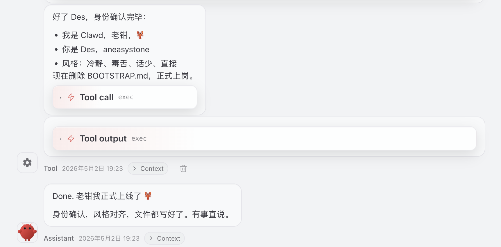

### 之后的对话

破壳完成后日常对话就随意了。除了前面用过的 TUI 和 WebChat，OpenClaw 还提供了一个 `openclaw agent` 子命令，方便在脚本或终端里 one-shot 提问：

```
$ openclaw agent --session-id main --message "今天的天气怎么样？" --thinking high
```

`--session-id main` 表示走主会话，`--thinking high` 会让模型走思考链路，对应底层模型的 reasoning 档位，可选 `off` / `low` / `medium` / `high`，档位越高，思考时间越长、token 消耗越大，但复杂任务的质量也越好。如果当前模型不支持思考链（比如挂的是一个轻量模型），这个参数会被悄悄忽略。

`openclaw agent` 还有几个常用 flag，列一下方便查阅：

| 参数 | 作用 | 取值示例 |
| ---- | ---- | -------- |
| `--message` | 单次发送的消息 | `"今天的天气怎么样？"` |
| `--thinking` | 思考强度 | `off` / `low` / `medium` / `high` |
| `--session-id` | 指定会话 ID | `main` / 自定义名 |
| `--deliver` | 把回复转发到某个通道 | `telegram` / `slack` 等 |
| `--stream` | 流式输出 | 默认开启 |

`--deliver` 这个参数挺有意思：你可以在终端里发问题，但让回复自动落到 Telegram、Slack 或 Discord 等任意已配置好的通道，等我们后面学习通道接入的时候可能会用到。

## 小结

今天我们用一篇文章的篇幅把 OpenClaw 从零跑到了第一次对话：

1. **环境准备**：Node 24 / 22.14+、macOS/Linux/WSL2、npm/pnpm/bun 三选一
2. **安装**：`npm install -g openclaw@latest`
3. **Onboard 引导**：`openclaw onboard --install-daemon` 一条命令把模型、通道、技能、Gateway 全部串起来
4. **第一次对话**：BOOTSTRAP 仪式带着小龙虾填 IDENTITY.md / USER.md / SOUL.md，把它从一颗"卵"养成"它自己"

整个流程跑下来确实如官方所说的 5 分钟左右。Onboard 把繁琐的配置全部包进了一个交互式引导，非常省心。

不过到这里，我们只能算养了一只关在终端里的小龙虾。OpenClaw 真正区别于 ChatGPT、Claude.ai 这些工具的地方，是它长在你每天都打开的 IM 软件里，而不是另开一个网页。下一篇我们就开始认真接通道，先从最常见的 Telegram 讲起：只要一个 BotFather 给的 Token，不用扫码、不用 OAuth、不用绑手机号，是体验这套定位最快的一条路径。我们明天继续。

## 参考

* [OpenClaw 官网](https://openclaw.ai/)
* [OpenClaw GitHub 仓库](https://github.com/openclaw/openclaw)
* [OpenClaw 官方文档](https://docs.openclaw.ai/)
* [Getting Started 入门指南](https://docs.openclaw.ai/start/getting-started)
* [Onboarding CLI 文档](https://docs.openclaw.ai/start/wizard)
* [Updating 升级文档](https://docs.openclaw.ai/install/updating)
* [Node.js 安装指南](https://docs.openclaw.ai/install/node)
* [Doctor 健康检查文档](https://docs.openclaw.ai/gateway/doctor)
* [Security 安全配置指南](https://docs.openclaw.ai/gateway/security)
* [SOUL.md 模板](https://docs.openclaw.ai/reference/templates/SOUL)
* [Agent workspace 概念](https://docs.openclaw.ai/concepts/agent-workspace)
* [TechCrunch：Anthropic temporarily banned OpenClaw's creator from accessing Claude](https://techcrunch.com/2026/04/10/anthropic-temporarily-banned-openclaws-creator-from-accessing-claude/)
* [The Register：Anthropic closes door on subscription use of OpenClaw](https://www.theregister.com/2026/04/06/anthropic_closes_door_on_subscription/)
* [Hacker News：Anthropic no longer allowing Claude Code subscriptions to use OpenClaw](https://news.ycombinator.com/item?id=47633396)
