# OpenClaw 接入第二个通道：飞书

昨天我们把小龙虾接进了 Telegram，顺便摸清了 OpenClaw 的 pairing 安全模型：陌生人发来的 DM 不会直接进 LLM，而是先生成一个配对码，需要管理员在终端用 `openclaw pairing approve` 显式放行。这套机制对所有通道都生效，今天接的飞书也不例外。

但 Telegram 在国内有个绕不过的现实问题 —— 得挂梯子。再加上工作场景里几乎没有团队真用它，这一篇我们换一个国内更接地气的通道：**飞书**。截至 2026 年初，飞书在国内做得相对完整：字节系自家在用，小米、理想、得到、蔚来、SHEIN 这些公司也都把内部办公迁到了飞书上。把小龙虾接到飞书，等于直接把它放进了你工作日 8 小时里最常打开的那个窗口 —— 群里 @ 一下就能让 AI 接管一段调研，DM 里发条消息就能让它整理日报、总结飞书文档。

## 为什么把小龙虾接到飞书

把 AI 接进 Telegram 大多是个人玩法，接进飞书则更像把它装进了团队工作流。下面有几个比较实用的场景供参考：

* **早晨日报提醒**：让小龙虾在每天 9:30 给我发一条 DM，把昨天的 GitHub Trending、最新的新闻或订阅的博客汇总发给我
* **群里召唤 AI 处理任务**：在团队群里 @ 它一下，让它接管一段调研或查文档回答问题，所有人都能看到结果，不用再单独转发
* **文档和会议总结**：飞书文档和飞书妙记是国内做得相对完整的一套，OpenClaw 内置 `feishu_doc` 工具能直接读写飞书文档，让小龙虾顺手把会议纪要做要点提炼，效率比手动复制粘贴高很多
* **多人协作**：在一个项目群里把 bot 当成虚拟成员，谁都可以让它干活，比每人本地装一份桌面端 AI 工具更轻

这些场景的共同点是：**消息流量本来就在飞书里，AI 跟着进飞书才不打断节奏**。如果还要先切到一个独立 webapp 或者命令行，体验就完全不同了。

整体的消息流转和 Telegram 思路类似，但传输方式不一样：

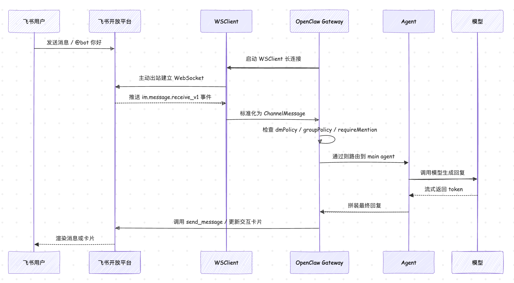

注意这里 Gateway 走的是 **WebSocket 长连接** 主动出站连到飞书开放平台，由飞书把事件推过来，本地不需要暴露任何端口。这对开发者非常友好，不用 ngrok、不用买公网机器，本机跑起来就能接收消息。

> 飞书也支持传统的 webhook 模式，作为长连接走不通时的兜底方案。两种模式下 OpenClaw 行为完全一致，只是事件的进入路径不同。

## 在飞书开放平台创建自建应用

飞书的接入逻辑和 Telegram、Discord 不太一样。Telegram 给一个 BotFather，三句对话拿走 Token 就能跑；飞书走的是更接近企业 IM 的 **自建应用** 路线：先在企业开放平台创建一个应用，给它开机器人能力，再开事件订阅，最后拿到 `App ID` 和 `App Secret` 这两把钥匙。整个流程都在网页上完成，第一次走可能会觉得页面菜单有点多，下面我们一步一步对着截图走一遍。

### 第一步：登录开放平台

打开浏览器访问 [飞书开放平台](https://open.feishu.cn/)，注册账号并登录。

> 海外版 Lark 是另一个独立环境，地址是 `open.larksuite.com`，账号、应用、API 域名都不与国内飞书互通。如果你的团队用的是 Lark，记得在 OpenClaw 配置里把 `domain` 设成 `lark`。

登录之后点击右上角的 **开发者后台**：

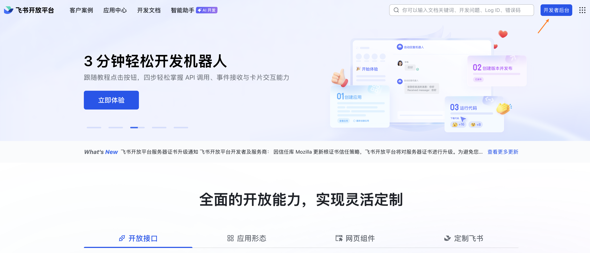

### 第二步：创建企业自建应用

进入开发者后台后，点击 **创建企业自建应用** 按钮，弹窗里填三项：

* **应用名称**：会出现在群成员列表和消息发送者位置，建议起个有辨识度的名字，比如 `老钳`
* **应用描述**：随便写一句给自己看，比如 `基于 OpenClaw 的个人 AI 助手`
* **应用图标**：上传一张方形图，或者选平台内置的图标，没现成的素材直接用龙虾 emoji 也行

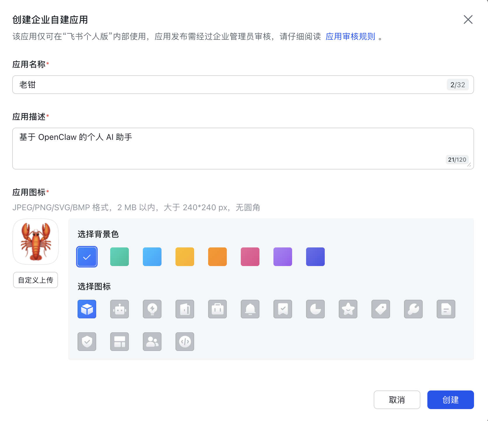

确认之后会跳到刚创建的应用详情页，URL 里能看到一串 `cli_xxx` 形式的 ID，这就是 App ID。

### 第三步：记下 App ID 和 App Secret

应用详情页左侧导航选 **凭证与基础信息**，右边能看到这两把钥匙：

* **App ID**：以 `cli_` 开头，公开可见，用来标识应用
* **App Secret**：一长串随机字符，私密，OpenClaw 用它换 access token

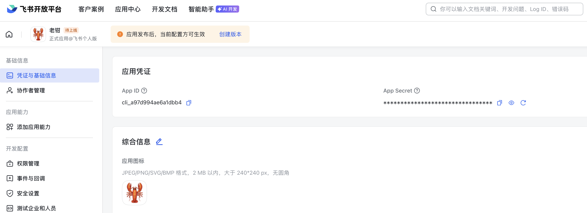

记下这两个值，等会儿要写进 OpenClaw 的配置里。

> App Secret 等同于这个应用的密码，**不要提交到 Git，不要贴到群里**。万一不小心泄露了，回到这一页点击 **重置** 立刻吊销并重新生成；OpenClaw 那边的配置也得同步换新。

### 第四步：开启机器人能力

左侧导航选 **添加应用能力**，找到 **机器人** 这一项，点击 **添加**。这一步只是给应用打开 bot 形态，还没有配置具体的消息行为。

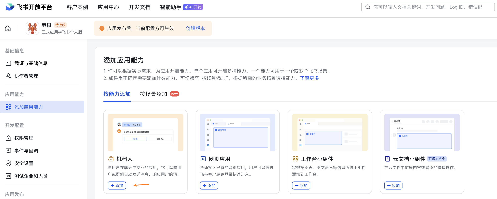

### 第五步：选择长连接事件订阅

左侧导航选 **事件与回调 → 事件配置**，最上面有个 **配置订阅方式** 区域，这里有两个互斥的选项：

* **使用长连接接收事件**：飞书主动连过来，本地不需要公网地址，**推荐**
* **将事件发送至开发者服务器**：传统的 webhook 模式，需要公网回调地址

OpenClaw 默认走长连接（`connectionMode: "websocket"`），所以这里选第一个就行：

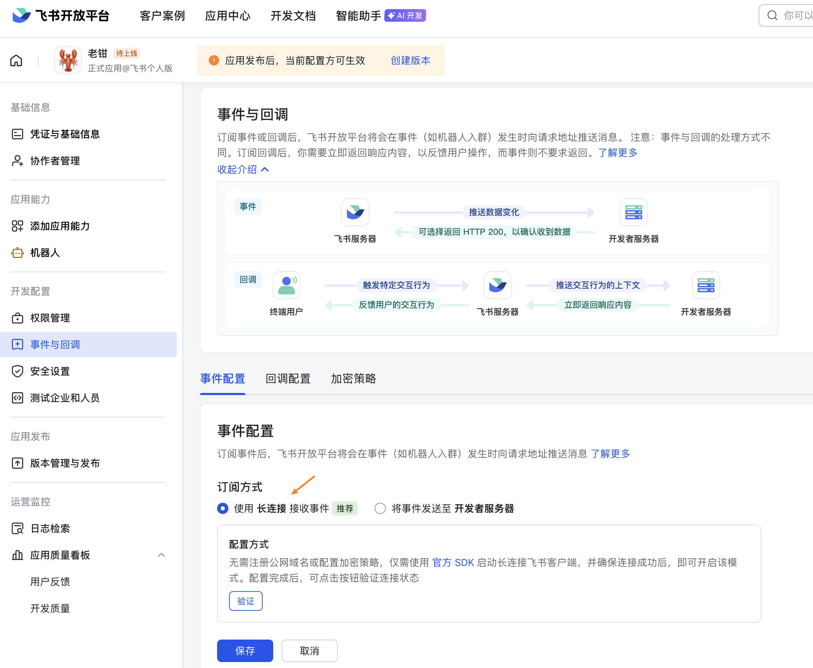

webhook 模式后面专门起一节讲，本节按推荐路径走。

### 第六步：订阅 im.message.receive_v1 事件

往下滚到 **事件管理**，点 **添加事件**，搜索 `im.message.receive_v1`，勾上保存。这个事件就是"用户给 bot 发了一条消息"的那个钩子，没有它 bot 就根本收不到消息。

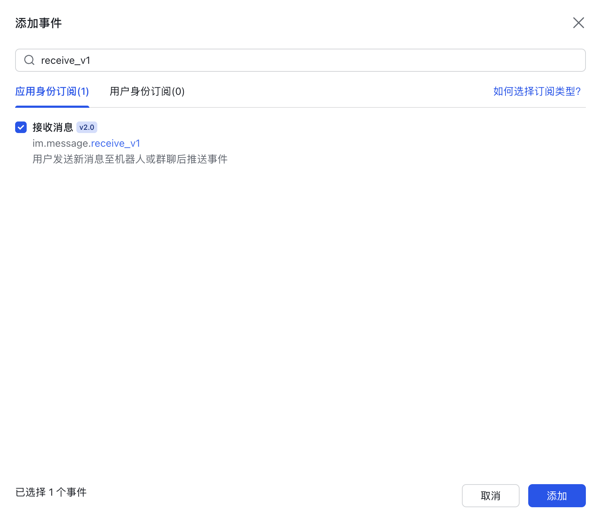

订阅完之后右边权限栏会自动列出这个事件依赖的权限项，比如 `im:message`，等会儿在权限管理里要统一开。

### 第七步：开通核心权限

左侧导航选 **权限管理**，最小可跑就开三项：

| 权限码 | 用途 |
| ---- | ---- |
| `im:message` | 收发消息的基础权限 |
| `im:chat` | 读取群基础信息（群名、群成员） |
| `contact:contact.base:readonly` | 读取用户基础信息（昵称、头像） |

逐项点 **申请权限** 即可。

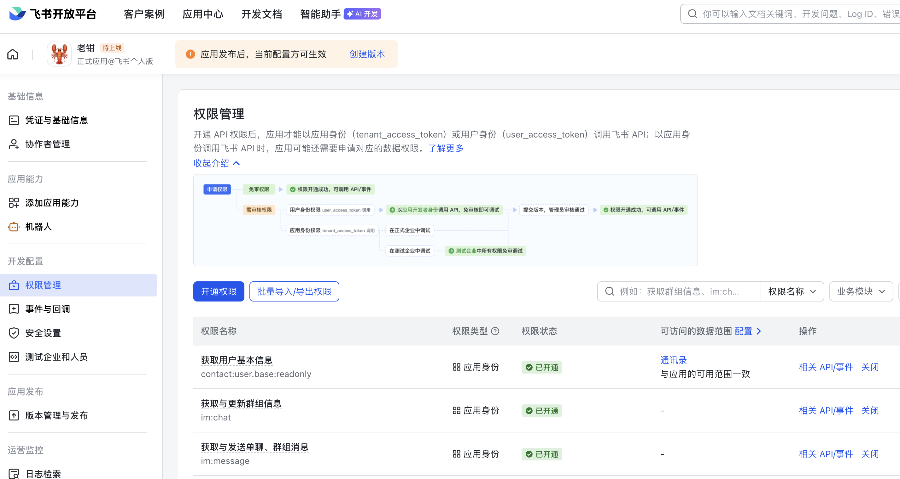

> 这三项是从 OpenClaw 源码 `extensions/feishu/src/setup-surface.ts:153` 的引导文案里抠出来的，引导只列了这三项，最小可跑就够了。如果还想让小龙虾读写飞书文档、知识库、云盘、多维表，再追加 `docx`、`wiki`、`drive`、`bitable` 相关权限即可 —— 不开也能跑，只是相应的 `feishu_doc`、`feishu_drive` 等工具调用会因为权限不足报错。

### 第八步：发布并审批

最后左侧导航选 **版本管理与发布**，点 **创建版本**，选可见范围，提交审核。

* 个人开发账号可以选 **仅自己可见**，秒过
* 企业账号必须等管理员在飞书 App 的审批列表里点 **同意**，才能在企业内推送

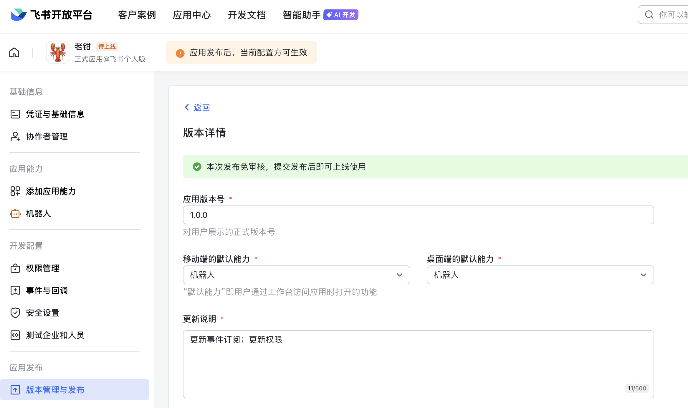

至此飞书侧的所有工作就全部完成了，下一步回到本地开始 OpenClaw 的配置。要注意的是，审批没通过之前，长连接会被服务端拒绝，一定要等状态变成 **已发布**。

## OpenClaw 配置

拿到 `App ID` 和 `App Secret` 之后，回到本机，编辑 `~/.openclaw/openclaw.json`，加一段 `channels.feishu`：

```json
{
  "channels": {
    "feishu": {
      "enabled": true,
      "domain": "feishu",
      "connectionMode": "websocket",
      "defaultAccount": "main",
      "accounts": {
        "main": {
          "appId": "cli_xxxxxxxxxxxxxxxx",
          "appSecret": "xxxxxxxxxxxxxxxxxxxxxxxxxxxxxxxx",
          "name": "老钳"
        }
      },
      "dmPolicy": "pairing"
    }
  }
}
```

各个字段逐项解释如下：

* **`enabled`**：通道总开关，默认 `true`，置为 `false` Gateway 会跳过初始化
* **`domain`**：API 域名，国内用 `feishu`，海外或 Lark 用户用 `lark`，私有部署也支持直接填 `https://...` 自定义 URL
* **`connectionMode`**：事件传输方式，`websocket` 走长连接，`webhook` 走 HTTP 回调，默认 `websocket`
* **`defaultAccount`**：多账号场景下，对外发起 API 调用使用的默认账号 ID，单账号留空走 `default` 即可
* **`accounts.<id>.appId`** 和 **`accounts.<id>.appSecret`**：从飞书开放平台 **凭证与基础信息** 页拿到的两个值
* **`dmPolicy`**：DM 准入策略，可选 `pairing`、`allowlist`、`open`，**默认 `pairing`**

除此之外，还有 `textChunkLimit`、`mediaMaxMb`、`streaming`、`typingIndicator` 等更多参数，参考官方文档：https://docs.openclaw.ai/channels/feishu

如果不想手写 JSON 配置，OpenClaw 还提供一条更省事的命令：

```
$ openclaw channels login --channel feishu
```

向导会弹出一个二维码，用飞书 App 扫一下就能在开放平台侧自动创建应用、把凭证写回本地配置，省掉手动跑一遍开放平台界面。这条命令需要 OpenClaw 2026.4.25 及以上版本，老版本用 `openclaw update` 升一下。

> 这个方法我没有验证，不知道为什么该命令在我的电脑上运行会卡死，如果有验证通过的小伙伴，欢迎交流。

## webhook 模式与内网穿透

如果出于某些原因不能走长连接（比如内网防火墙拦了出站 WebSocket，或者部署在已有 HTTP 网关后面想统一接入），可以切到 webhook 模式。这种情况下飞书会主动把事件 POST 到我们的回调地址，因此本地必须有一个公网可达的 URL。

切换 webhook 模式的配置如下：

```json
{
  "channels": {
    "feishu": {
      "connectionMode": "webhook",
      "verificationToken": "v_xxxxxxxxxxxxxxxx",
      "encryptKey": "e_xxxxxxxxxxxxxxxx",
      "webhookPath": "/feishu/events",
      "webhookHost": "127.0.0.1",
      "webhookPort": 3000
    }
  }
}
```

* **`verificationToken`**：飞书在事件订阅页生成的校验令牌，用来验证请求来自飞书
* **`encryptKey`**：可选的加密密钥，启用后飞书会用 AES 加密事件 payload，OpenClaw 收到后解密
* **`webhookPath`**：本地 HTTP 服务挂载的回调路径，默认 `/feishu/events`
* **`webhookHost`** 和 **`webhookPort`**：本地监听地址和端口，默认 `127.0.0.1:3000`

本地开发阶段，常见做法是用内网穿透工具把 `127.0.0.1:3000` 暴露到公网：

* `ngrok http 3000`：最常见，随机域名，免费版有连接数限制
* `cloudflared tunnel`：Cloudflare 出品，速度稳定，绑自有域名免费
* `frp` 自建反向代理：有自己的云服务器时最划算

启动穿透之后，把得到的公网地址（比如 `https://xxx.ngrok-free.app/feishu/events`）填回飞书开放平台的 **请求地址** 一栏。生产环境一般直接部署到云服务器，省掉穿透环节。

## 启动并验证

配置写好之后，重启 Gateway：

```
$ openclaw gateway restart
```

正常启动之后，使用下面的命令查看 channel 状态：

```
$ openclaw channels status --probe
```

输出类似这样：

```
Gateway reachable.
- Feishu default (老钳): enabled, configured, running, works
```

### 私聊配对

我们先验证 DM 通路。在飞书 App 里打开你刚创建的应用名，发一条 `你好`，由于 `dmPolicy: "pairing"`，bot 不会接话，而是会回复一段配对提示，里面带一个 8 位的大写字母数字混合代码，比如 `A3KQ7M2N`。代码 1 小时过期，单 channel 同时最多挂 3 个待审批请求。

> 我在测试时发现，有时 bot 不会返回配对提示，但是运行 `openclaw pairing list` 能正常看到配对请求，这时候只需要按下面的步骤 approve 就行了。

切回管理员的终端，先列一下当前所有挂起的配对请求：

```
$ openclaw pairing list feishu

Pairing requests (1)
│ Code     │ feishuUserId      │ Meta                                          │ Requested                │
│ A3KQ7M2N │ ou_8c1f...e3      │ {"accountId":"default"}                       │ 2026-05-03T13:05:57.015Z │
```

输出里能看到配对码、飞书用户的内部 ID（形如 `ou_xxx`）、请求时间。确认是预期的人之后，approve 它：

```
$ openclaw pairing approve feishu A3KQ7M2N

Approved feishu sender ou_8c1f...e3.
```

approve 之后，再发一条测试消息，就会被放行进入 agent 了：

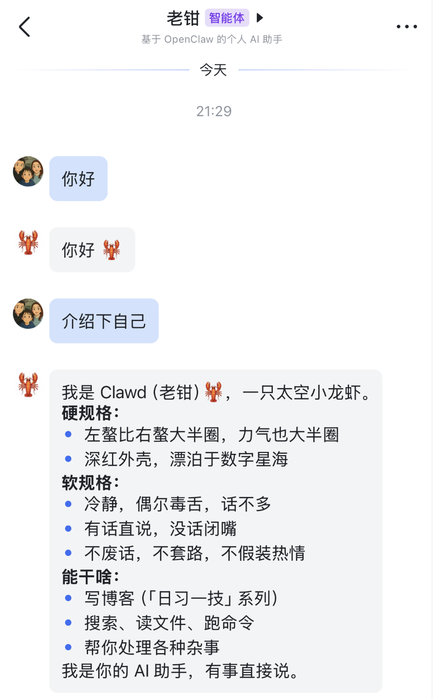

## 群组场景

把 bot 拉进群之后，事情会比 DM 复杂一些。如果我们直接在群里 `@bot` 发送消息，它是不会回复你的。检查 OpenClaw 的日志，会看到类似下面的信息：

```
21:58:53 [feishu] feishu[default]: received message from ou_e146a012928e16xxx in oc_f710113a6e42yyy (group)
21:58:53 [feishu] feishu[default]: group oc_f710113a6e42yyy not in groupAllowFrom (groupPolicy=allowlist)
```

这是因为 `groupPolicy` 默认是 `allowlist` 且 `groupAllowFrom` 为空，导致 bot 不会被触发。需要把 `groupAllowFrom` 配置为目标群组 ID （形如 `oc_xxx`）才能正常工作。这和 Telegram 的行为类似，OpenClaw 的默认策略都是先关门，再根据需要慢慢开门。可以在 `~/.openclaw/openclaw.json` 里增加如下配置：

```json
{
  "channels": {
    "feishu": {
      "groupPolicy": "allowlist",
      "groupAllowFrom": ["oc_f710113a6e42yyy"]
    }
  }
}
```

再次重启 Gateway 并验证，这时 bot 就能正常在群里对话了：

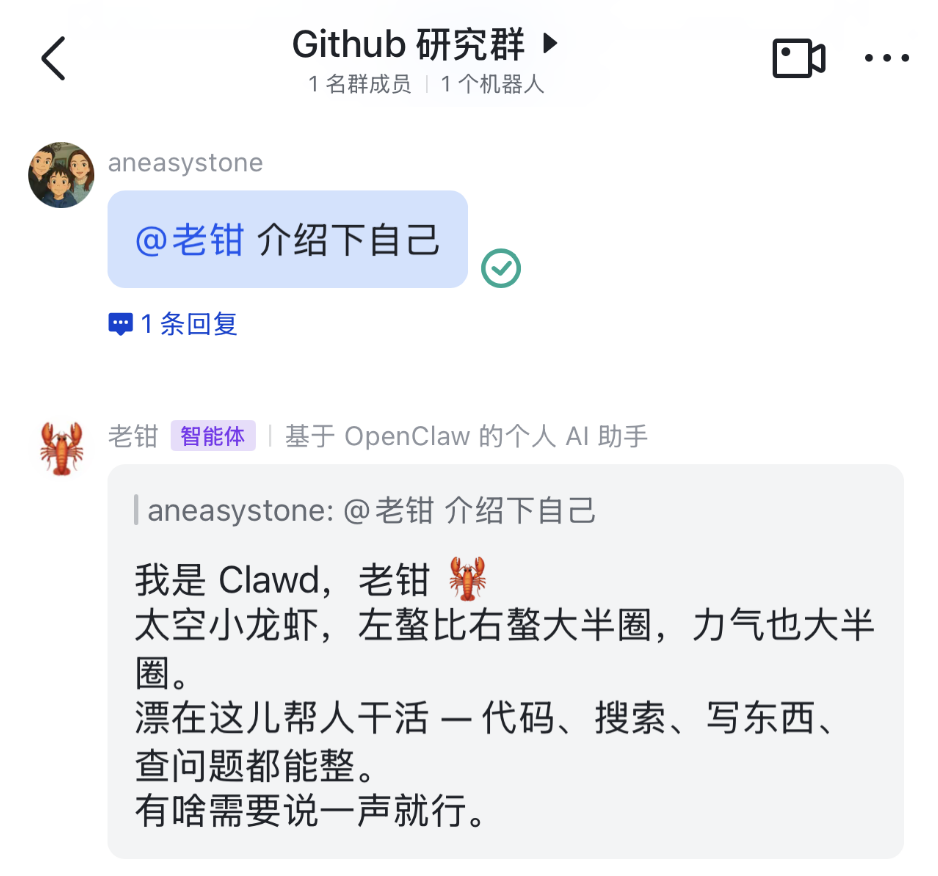

另外，除了 `allowlist`，`groupPolicy` 还有 `open` 和 `disabled` 两种选项：

| 取值 | 行为 |
| ---- | ---- |
| `open` | 所有群都响应，最自由也最容易被滥用 |
| `allowlist` | 只响应 `groupAllowFrom` 列出的群，或者在 `groups.<chat_id>` 下显式配置过的群 |
| `disabled` | 完全禁用群消息，即便有 `groups.<chat_id>` 显式配置也不响应 |

### @ 触发还是常驻倾听

群里和 DM 最大的区别是触发方式，`requireMention` 控制群里是否必须 @ bot 才触发回复：

* `true`（默认）：群里聊天大家不会被打扰，只有 @ 到 bot 才回应
* `false`：bot 监听全部消息，agent 自己判断要不要发声

这是个非常贴合办公场景的默认值，群里成员动辄几十上百，机器人对所有消息都搭话很快就会被踢出去。如果你建了一个专门跟 AI 对话的小群，希望它有问必答，把那个群单独切到 `requireMention: false` 就行：

```json
{
  "channels": {
    "feishu": {
      "groupPolicy": "allowlist",
      "requireMention": true,
      "groups": {
        "oc_aabbccddeeff": {
          "requireMention": false
        }
      }
    }
  }
}
```

> 这里有个常见的误会：飞书的 `@all` 和 `@_all` 是 **广播标记**，不算对 bot 的点名。OpenClaw 已经做了过滤，只有当一条消息明确 @ 你的 bot，才会被认为被点名。

### 群内还能进一步收紧

`allowFrom` 在飞书场景下也很有用。比如你想做一个只允许运维组同事调用的运维机器人，就在群里把 `allowFrom` 限定到运维组成员的 `user_id`：

```json
{
  "channels": {
    "feishu": {
      "groupPolicy": "allowlist",
      "groupAllowFrom": ["oc_ops_room"],
      "groups": {
        "oc_ops_room": {
          "allowFrom": ["ou_alice", "ou_bob", "ou_charlie"]
        }
      }
    }
  }
}
```

群里其他成员 @ 它也不会触发响应，OpenClaw 会直接在 sender 校验环节把消息丢掉。

## 小结

通过这一篇，我们把 OpenClaw 接进了飞书：

1. **创建自建应用**：在飞书开放平台开机器人能力，记下 `App ID` 和 `App Secret`，开 `im:message`、`im:chat`、`contact:user.base:readonly` 三项核心权限，订阅 `im.message.receive_v1` 事件，把版本发布并审批通过
2. **写最小配置**：在 `~/.openclaw/openclaw.json` 的 `channels.feishu` 下填账号、`dmPolicy`、`groupPolicy`、`requireMention` 这几个关键开关；不想手写也可以直接 `openclaw channels login --channel feishu` 扫码完成
3. **传输模式**：默认走 WebSocket 长连接，省掉公网回调地址；webhook 模式作为兜底，需要内网穿透或云部署
4. **DM 默认 pairing**：陌生人通过配对码请求白名单，管理员显式 `approve` 才放行；底层就是 `policy.ts` 里那十几行 `isSenderIdAllowed` 风格的判定
5. **群聊治理**：`groupAllowFrom` 控制哪些群能用，`requireMention` 控制是否必须 @，`@all` 不算 @ 到 bot；可以配合 `allowFrom` 进一步限定群聊范围

到这里 OpenClaw 的通道接入就告一段落了。Telegram 和飞书一外一内，跑通这两个之后剩下的 Slack、Discord、企业微信、钉钉的接入思路都大同小异，只是开放平台的具体术语变一变。

不过到目前为止小龙虾还是个"被动型选手" —— 我们发它才回。开头我提到一个场景："让小龙虾在每天 9:30 给我发一条 DM，把昨天的 GitHub Trending、最新的新闻或订阅的博客汇总发给我"，要让 bot 反过来主动找你，就得给它装上自己启动的发条。OpenClaw 在这件事上提供了两种最基础的机制：**Cron** 负责按精确时间表干活，**Heartbeat** 负责主会话隔一会儿自己醒一下看一眼。下一篇我们就来学习这两个机制。

## 参考

* [OpenClaw 飞书通道文档](https://docs.openclaw.ai/channels/feishu)
* [OpenClaw Pairing 机制文档](https://docs.openclaw.ai/channels/pairing)
* [OpenClaw Groups 文档](https://docs.openclaw.ai/channels/groups)
* [OpenClaw Gateway Security 文档](https://docs.openclaw.ai/gateway/security)
* [飞书开放平台](https://open.feishu.cn/)
* [Lark Developer（海外版）](https://open.larksuite.com/)
* [飞书自建应用机器人开发指南](https://open.feishu.cn/document/uAjLw4CM/ukTMukTMukTM/bot-v3/bot-overview)
* [飞书事件订阅 im.message.receive_v1](https://open.feishu.cn/document/uAjLw4CM/ukTMukTMukTM/reference/im-v1/message/events/receive)
* [@larksuiteoapi/node-sdk](https://github.com/larksuite/node-sdk)
* [ngrok](https://ngrok.com/)
* [cloudflared](https://github.com/cloudflare/cloudflared)
